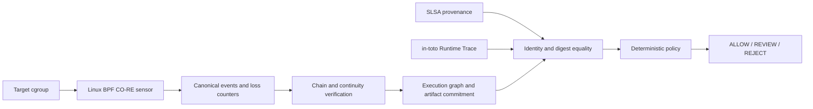

# Runtime Provenance Firewall

Runtime Provenance Firewall is a research prototype that correlates cgroup-scoped Linux/eBPF evidence with artifact digests, SLSA provenance, and in-toto Runtime Trace statements. It recomputes the evidence chain and returns `ALLOW`, `REVIEW`, or `REJECT` from explicit policy; known event loss cannot produce `ALLOW`.

While SLSA provenance records source repository, builder identity, declared inputs, and final artifact digests, it does not record child process execution, sensitive file access during package installation, or network connection attempts. Conversely, system observability tools collect execution events, but telemetry alone does not cryptographically prove that runtime traces, source code, and build artifacts originate from the same verified execution.

The verifier checks deterministic equalities across runtime evidence, build metadata, and policy rules. It does not establish a trusted host or prove that every relevant operation was observed; see [limitations](docs/limitations.md).

## Overview



The system combines:
1. **Linux BPF CO-RE Sensor**: Scoped to a target cgroup, recording successful `exec`, sensitive `openat` reads, artifact write-open operations, and IPv4 `connect` attempts.
2. **Correlation & Verification Core**: Reconstructs execution graphs, validates event sequence continuity and loss counters, and correlates runtime evidence with SLSA Provenance v1 and in-toto Runtime Trace v0.1 attestations.
3. **Deterministic Policy Evaluator**: Enforces strict allowlists for builder identities, source repositories, artifact producers, network destinations, and process paths.

## Key Invariants

- **Artifact Commitment**: Artifact bytes must match digests in SLSA provenance, runtime evidence manifests, and Runtime Trace subjects.
- **Identity Consistency**: Build ID, run ID, and source repository/revision must match between runtime evidence and SLSA provenance.
- **Tamper Evidence**: Event ordering and hash-chain continuity are verified sequentially.
- **Loss Sensitivity**: Any non-zero or unknown event loss prevents an `ALLOW` decision (fails closed).
- **Attribution**: Artifact finalization must be attributed to an authorized producing process.
- **Deterministic Evaluation**: Execution graphs and manifests are recomputed from raw event streams during verification rather than trusted as reported.
- **Process Identity**: Execution graph nodes represent process executable paths, while the underlying event stream digest cryptographically commits to full composite process identities (path, namespace IDs, and executable hash).

## Building and Testing

Prerequisites:
- Go 1.27 or newer (as required by `go.mod`)
- Linux kernel with cgroup v2, BTF, and eBPF support for sensor execution

### Running Tests

Run the Go test suite:

```console
go test -v ./...
go vet ./...
```

Run bundle serialization round-trip verification:

```console
go test ./internal/rpf -run TestBundleDiskRoundTrip -v
```

### Sensor & Laboratory Verification

On a Linux host with BPF privileges and Docker:

```console
# Run containerized kernel lab test
./tools/kernel-lab.sh

# Run full acceptance scenarios (benign, vulnerable, and patched paths)
./tools/final-acceptance.sh
```

## Repository Structure

- `cmd/rpf`: CLI tool for bundle assembly, validation, graph export, and verification.
- `cmd/rpf-sensor`: Linux daemon attaching BPF probes and streaming canonical event logs.
- `internal/rpf`: Core verification engine, model definitions, hash chaining, and policy evaluator.
- `internal/sensor`: BPF program loader and event decoding.
- `internal/sensor/bpf`: CO-RE eBPF C implementation (`sensor.bpf.c`).
- `lab/`: Test fixtures, policies, and kernel emulation scenarios.
- `docs/`: Architecture specifications, threat model, and evaluation benchmarks.

## Documentation

- [Architecture](docs/architecture.md)
- [Threat Model](docs/threat-model.md)
- [Event Schema](docs/event-schema.md)
- [Kernel Support](docs/kernel-support.md)
- [Security Policy](SECURITY.md)

## License

MIT
